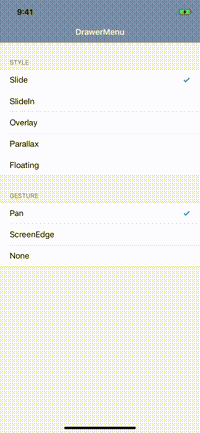
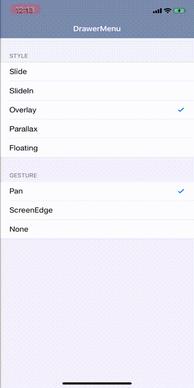
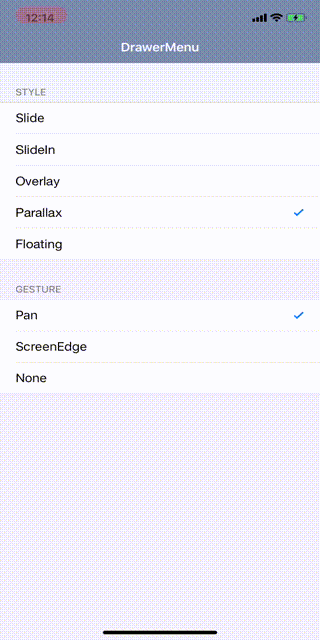
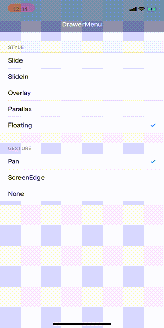

<H1 align="center">
DrawerMenu
</H1>
<H4 align="center">
Simple DrawerMenu<br>
Correspond to left right
</H4>

<p align="center">
  <a href="https://cocoapods.org/pods/DrawerMenu">
    
  </a>
  <a href="https://github.com/Carthage/Carthage">
    
  </a>
  <a href="https://developer.apple.com/swift">
    
  </a>
  <a href="https://developer.apple.com/">
    
  </a>
  <a href="">
    
  </a>
</p>

## Demo
| Slide                      | SlideIn                      | Overlay                      | Parallax                      | Floating                      |
|:-------------------------- |:---------------------------- | ---------------------------- | ----------------------------- | ----------------------------- |
|  |  |  |  |  |


## Requirements
- iOS 10.0 or later
- Swift5.0 or later


## Installation

#### Cocoapods

```ruby
pod 'DrawerMenu'
```

#### Carthage
```
github "y-hryk/DrawerMenu"
```

## Usage

### Setup
##### To the child of viewcontroller

```swift
import DrawerMenu

class ApplicationRootViewController: UIViewController {

    override func viewDidLoad() {
        super.viewDidLoad()

        let left = UIStoryboard(name: "Left", bundle: nil).instantiateInitialViewController()!
        let center = UIStoryboard(name: "Center", bundle: nil).instantiateInitialViewController()!

        let drawer = DrawerMenu(center: center, left: left)
        addChild(drawer)
        view.addSubview(drawer.view)
        drawer.didMove(toParent: self)
    }
}
```

##### RootViewController
```swift
func application(_ application: UIApplication, didFinishLaunchingWithOptions launchOptions: [UIApplication.LaunchOptionsKey: Any]?) -> Bool {
    // Override point for customization after application launch.

    window = UIWindow(frame: UIScreen.main.bounds)
    window?.backgroundColor = .white

    let left = UIStoryboard(name: "Left", bundle: nil).instantiateInitialViewController()!
    let center = UIStoryboard(name: "Center", bundle: nil).instantiateInitialViewController()!

    let drawer = DrawerMenu(center: center, left: left)
    window?.rootViewController = drawer
    window?.makeKeyAndVisible()

    return true
}
```

### Access the drawermenu from the viewcontroller
```swift
import DrawerMenu

drawer()?.open(to: .left)
```

### Open or Close
```swift
import DrawerMenu

// method call
drawer()?.open(to: .left)
drawer()?.open(to: .left, animated: true, completion: {

})
drawer()?.close(to: .right)
drawer()?.close(to: .right, animated: true, completion: {

})

// open or close status
drawer()?.isOpenLeft
drawer()?.isOpenRight

// panGesture settings
drawer()?.panGestureType = .none
drawer()?.panGestureType = .pan
drawer()?.panGestureType = .screenEdge
```

### Replace CenterViewController
```swift
let vc = UIViewController()
let nc = UINavigationController(rootViewController: vc)
drawer()?.replace(center: nc)
```

### Style
Please refer to each style class for details such as shadows and details
```swift
let drawer = DrawerMenu(center: center, left: left)
drawer.style = SlideIn()
```

### Custom style
You can customize the style.
```swift
import DrawerMenu

struct CustomStyle: DrawerMenuStyle {

    func setup(drawer: DrawerMenu) {
      // Initialize. Change the hierarchy of view
    }

    func leftProgress(menuWidth: CGFloat, drawer: DrawerMenu) -> CGFloat {
        // Current progress of left menu.
        // open = 1, close = 0
    }

    func rightProgress(menuWidth: CGFloat, drawer: DrawerMenu) -> CGFloat {
        // Current progress of right menu.
        // open = 1, close = 0
    }

    func leftTransition(menuWidth: CGFloat, progress: CGFloat, drawer: DrawerMenu) {
        // Operate the left menu
    }

    func rightTransition(menuWidth: CGFloat, progress: CGFloat, drawer: DrawerMenu) {
        // Operate the right menu
    }
}
```

## License

DrawerMenu is available under the MIT license. See the LICENSE file for more info.
